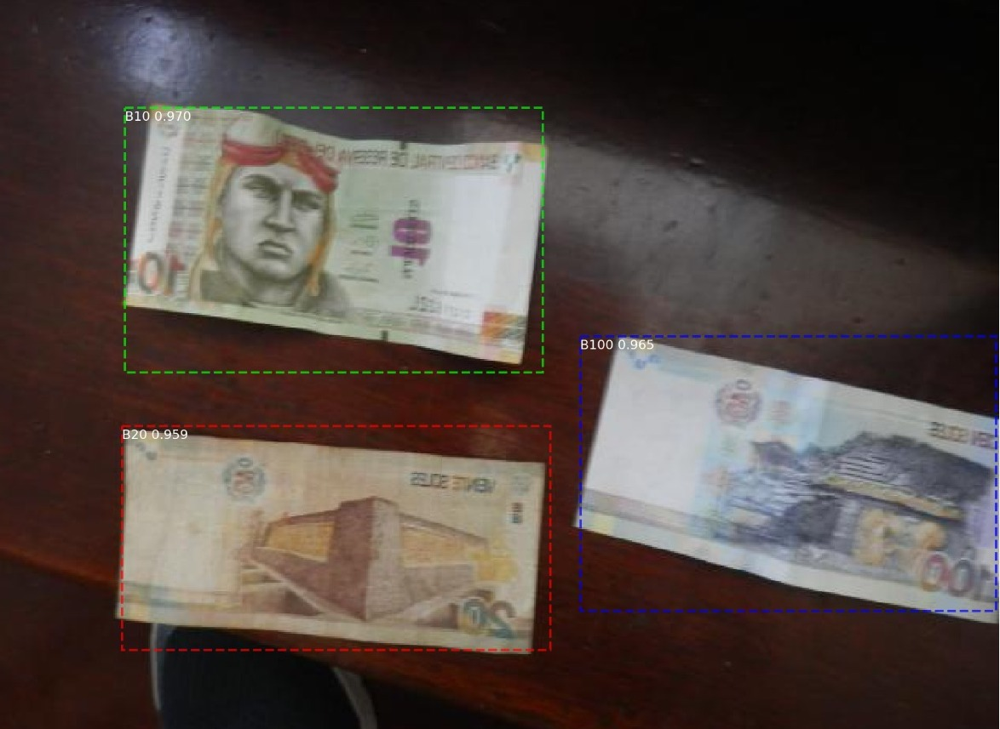

# EDA & ML for Peruvian Bills/Notes

## Data Science technologies for Identify and detect peruvian currency (bills and notes)

### By Romell Domínguez

## Target

### You can also view online via:

#### Multiclass Logistic Regression ->   

#### Mask RCNN ->   

#### TensorFlow Object Detection ->   

## Requirements

* [Python 3.6](https://www.python.org/downloads/release/python-360/)
* [Jupyter Notebook](http://jupyter.org/)

## License

MIT. See the LICENSE file for the copyright notice.

**2018, September**

